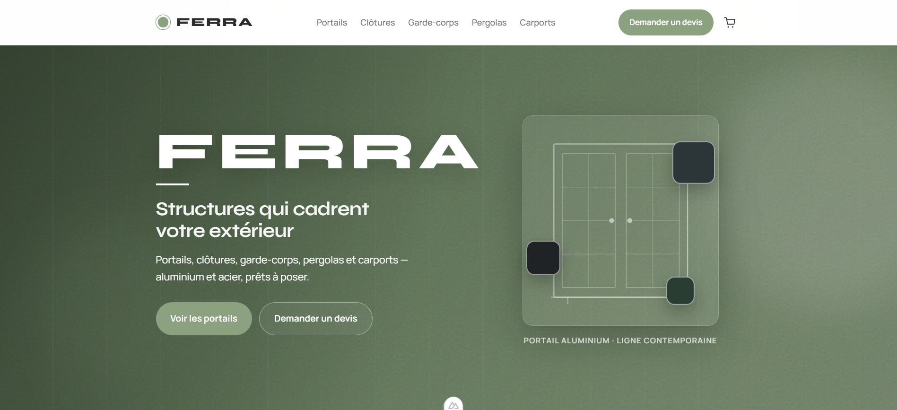
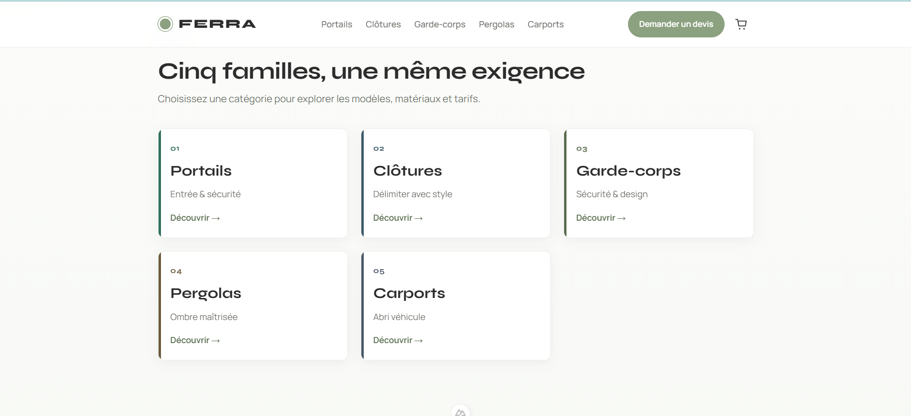
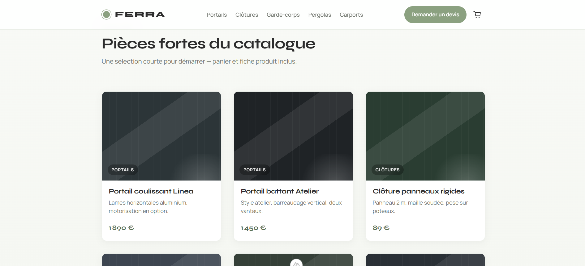
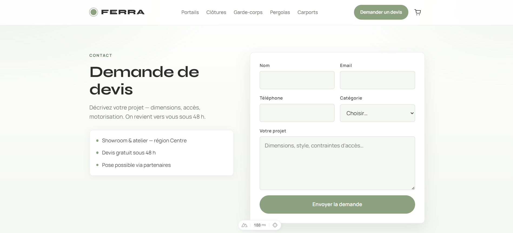
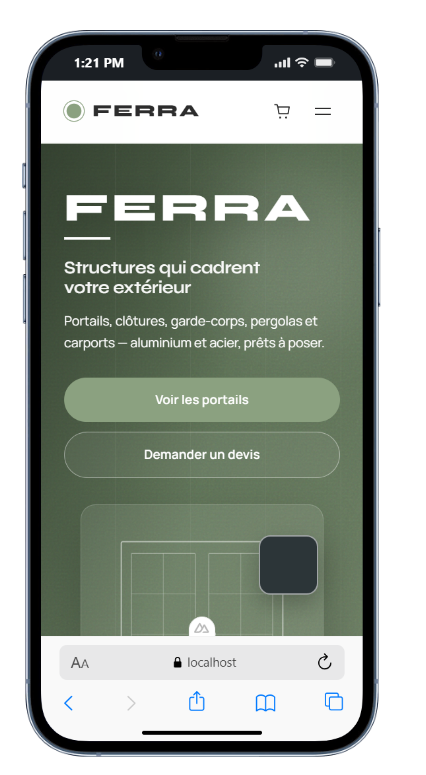
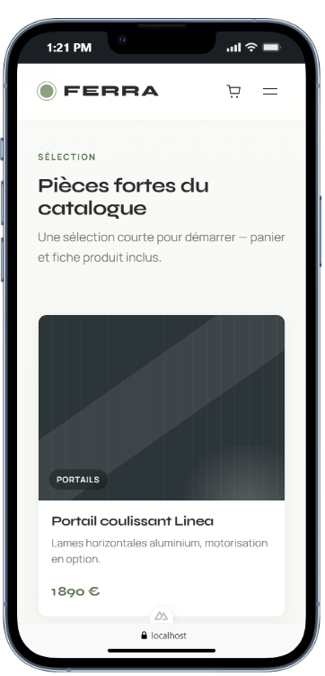
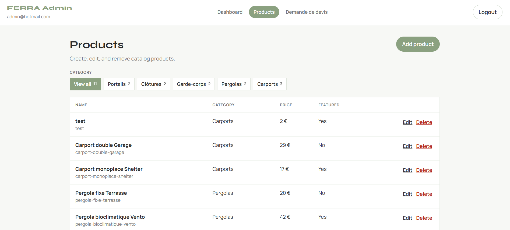
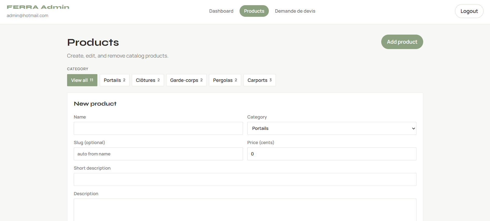
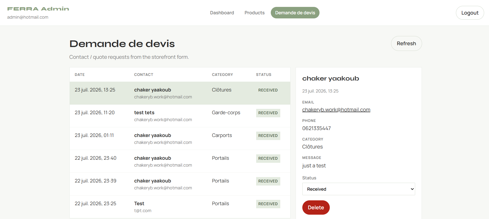
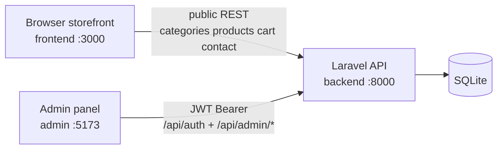

# FERRA — Nuxt + Laravel e-commerce (demo)

Monorepo for an outdoor metal structures shop (**portails, clôtures, garde-corps, pergolas, carports**).

Three apps talk to one Laravel API + SQLite database.

---

## Screenshots

### Shop (Nuxt client)

**Home**



**Categories**



**Catalogue**



**Demande de devis**



**Home (mobile)**



**Catalogue (mobile)**



### Admin (Vue panel)

**Products**



**Add product**



**Demande de devis**



---

## Projects overview

```text
Nuxt_Laravel/
├── assets/     → README screenshots
├── frontend/   → Nuxt storefront (clients)
├── backend/    → Laravel API + SQLite + JWT
└── admin/      → Vite Vue admin panel
```

| Project | Tech | Role |
|---------|------|------|
| **frontend** | Nuxt 4, Vue 3, TypeScript | Public shop: catalogue, product pages, cart, contact / devis |
| **backend** | Laravel, SQLite, JWT | REST API + data + auth for admin |
| **admin** | Vite + Vue + vue-router | Back-office: products CRUD, demandes de devis, dashboard |

### How they connect



---

## 1. Frontend (`frontend/`) — client storefront

**What it does**

- Home, categories, product detail, cart, contact (“Demande de devis”)
- Reads catalogue from Laravel only (no local fake catalog)
- Cart synced via `POST/PATCH/DELETE /api/cart` + header `X-Cart-Session` (guest cart, **no client login**)
- SEO: meta tags, JSON-LD, sitemap

**Run**

```bash
cd frontend
npm install
npm run dev
```

→ http://localhost:3000  

API base: `runtimeConfig.public.apiBase` → `http://localhost:8000/api`

---

## 2. Backend (`backend/`) — API + database

**What it does**

- Public API for the shop
- JWT auth for admin (`php-open-source-saver/jwt-auth`)
- SQLite file: `backend/database/database.sqlite`

**Public endpoints**

| Method | Path | Purpose |
|--------|------|---------|
| GET | `/api/categories` | List categories |
| GET | `/api/categories/{slug}` | One category |
| GET | `/api/products` | List products (`?category=&featured=`) |
| GET | `/api/products/{slug}` | One product |
| GET/POST/PATCH/DELETE | `/api/cart`… | Guest cart |
| POST | `/api/contact` | Save quote request |

**Admin (JWT)**

| Method | Path | Purpose |
|--------|------|---------|
| POST | `/api/auth/login` | Login |
| GET | `/api/auth/me` | Current admin |
| GET/POST/PUT/DELETE | `/api/admin/products`… | Product CRUD |
| GET/PATCH/DELETE | `/api/admin/quotes`… | Devis list / status |
| GET | `/api/admin/dashboard` | Counts |

**Default admin**

- Email: `admin@hotmail.com`
- Password: `password`

**Run**

```bash
cd backend
composer install
php artisan migrate --seed
php artisan serve
```

→ http://127.0.0.1:8000

---

## 3. Admin (`admin/`) — back-office

**What it does**

- Real JWT login (not fake)
- Dashboard stats
- Products: list, filter by category, create / edit / delete
- Demande de devis: list, change status, delete

**Run**

```bash
cd admin
npm install
npm run dev
```

→ http://localhost:5173 (or 5174)

---

## Quick start (all three)

```bash
# Terminal 1 — API
cd backend && php artisan serve

# Terminal 2 — Shop
cd frontend && npm run dev

# Terminal 3 — Admin
cd admin && npm run dev
```

1. Shop: http://localhost:3000  
2. Admin: http://localhost:5173 — login `admin@hotmail.com` / `password`  
3. API: http://127.0.0.1:8000/api  

---

## What is / isn’t implemented

| Feature | Status |
|---------|--------|
| Catalogue + cart + devis (client) | Yes |
| Admin JWT + products + quotes | Yes |
| Client login / register | **No** (guest session cart only) |
| Real payments / checkout | **No** (devis flow instead) |
